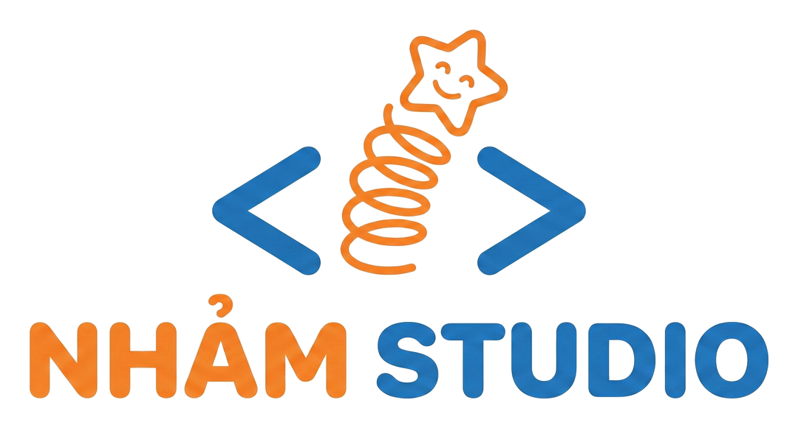

# StoryReader

<p align="center"></p>

Ứng dụng Android tìm và đọc truyện từ các nguồn miễn phí, đọc theo kiểu **lật trang** như sách giấy.

- **Dev:** NhảmStudio
- **Web:** https://topvl.net

## Tính năng

- 🔎 **Tìm kiếm** đồng thời trên nhiều nguồn, bật/tắt từng nguồn.
- ❤️ **Yêu thích (Tủ truyện)** và **lịch sử đọc** – tự lưu chương & vị trí đang đọc, "Đọc tiếp" một chạm.
- 🔖 **Bookmark** tại bất kỳ trang nào (lưu theo vị trí ký tự nên không lệch khi đổi cỡ chữ).
- 📖 **Đọc dạng lật trang**: vuốt hoặc chạm cạnh trái/phải để lật, hiệu ứng lật quanh gáy sách,
  tự chuyển chương, mục lục, thanh kéo trang.
- 🎨 Tuỳ chỉnh cỡ chữ, giãn dòng, phông có chân/không chân, nền Sáng/Giấy/Tối; giữ màn hình sáng khi đọc.
- 🏷️ Ghi rõ nguồn ở trang truyện, trên từng chương và từng trang; mở trang gốc bằng một chạm.

## Nguồn truyện

| Nguồn | Website | Cách lấy dữ liệu |
|---|---|---|
| Wattpad | https://www.wattpad.com | API công khai của Wattpad |
| TruyenFull | https://truyenfull.live | Đọc trang HTML công khai |
| Project Gutenberg | https://www.gutenberg.org | API Gutendex (sách phạm vi công cộng) |

> VietMessenger (vietmessenger.net) hiện chỉ còn trang "coming soon" và TàngThưViện không truy cập được
> tại thời điểm phát triển, nên chưa được tích hợp. Có thể bổ sung nguồn mới bằng cách triển khai
> interface `StorySource` (`app/src/main/java/net/topvl/storyreader/source/`).

## Miễn trừ trách nhiệm

StoryReader hoạt động như một trình duyệt chuyên dụng: ứng dụng **không lưu trữ, sở hữu hay phát hành**
nội dung truyện nào trên máy chủ riêng. Toàn bộ nội dung được tải trực tiếp từ các website nguồn công khai
và luôn được ghi rõ nguồn. Bản quyền thuộc về tác giả, dịch giả và website nguồn tương ứng.
NhảmStudio không chịu trách nhiệm về tính chính xác, hợp pháp hay bản quyền của nội dung do các nguồn cung cấp.
StoryReader không liên kết hay được xác nhận bởi bất kỳ website nguồn nào; tên và nhãn hiệu thuộc về chủ sở hữu.
Chủ sở hữu nội dung muốn gỡ một nguồn khỏi ứng dụng vui lòng liên hệ qua https://topvl.net.

## Tải APK

APK được build tự động bằng GitHub Actions (`.github/workflows/build.yml`) và đăng tại mục
**Releases** của repo mỗi khi có commit mới trên `main`.

## Build thủ công

Yêu cầu JDK 17 và Android SDK (compileSdk 35):

```bash
./gradlew assembleRelease
# APK: app/build/outputs/apk/release/app-release.apk
```

### Khoá ký APK

Mặc định APK được ký bằng `app/nhamstudio.keystore` có sẵn trong repo (để bản cập nhật cài đè được).
Để dùng khoá riêng an toàn hơn, đặt các biến môi trường / GitHub Secrets:
`KEYSTORE_FILE`, `KEYSTORE_PASSWORD`, `KEY_ALIAS`, `KEY_PASSWORD`.
